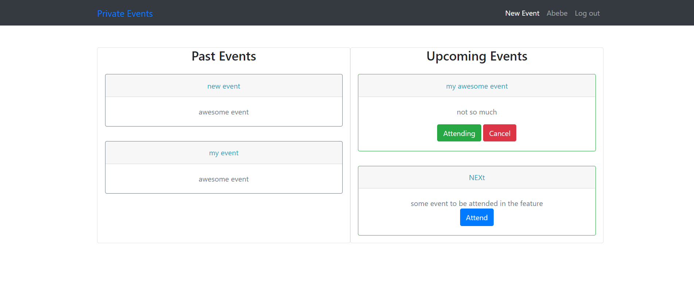
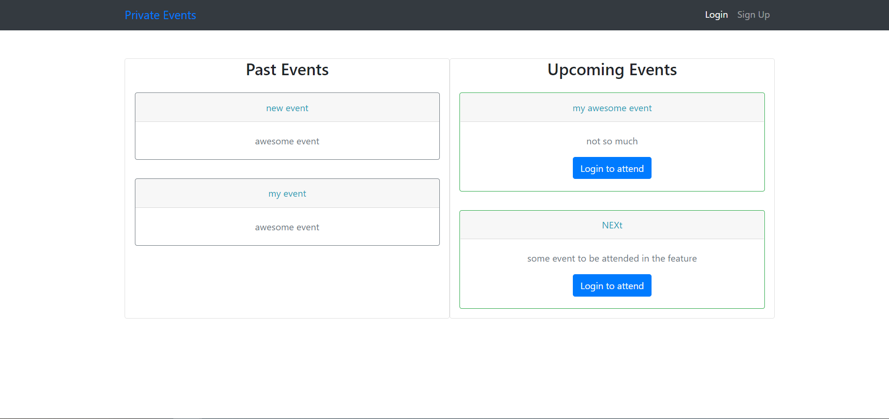
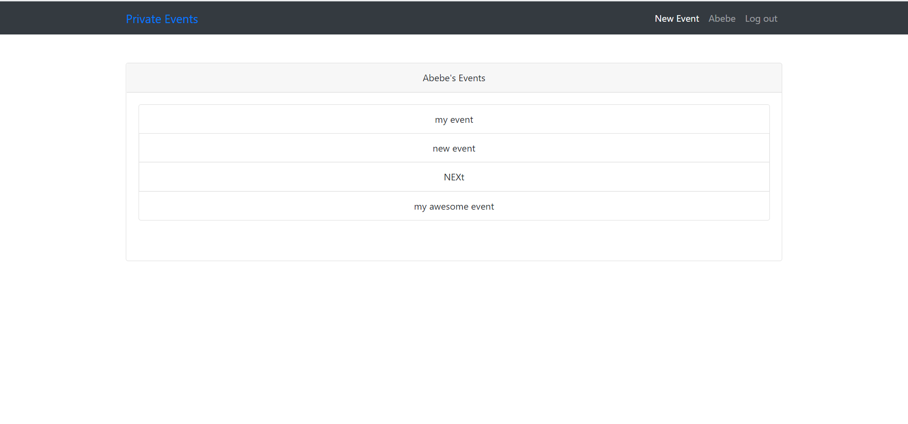

# Private Event
### This is a Microverse Ruby or rails track project where users can create and attend an event.


### Sign up Interface


### Index


### Dashboard


## Built With

- Ruby on Rails
- Rspec gem
- Capybara gem
- Database_cleaner gem
- Bootstrap
- sqlite 3
- VScode
- Rubocop

## Getting Started on local repo

To get a local copy up and running follow these simple example steps.

### Install
In order to run, you need to install RUBY and Rails in your computer. For windows you can go to [Ruby installer](https://rubyinstaller.org/) and for MAC and LINUX you can go to [Ruby official site](https://www.ruby-lang.org/en/downloads/) for intructions on how to intall it.

Clone this project by typing ```git clone https://github.com/sinework/private-events```

### Run app
- Type ```bundle install``` in the root file of the project.
- Type  ```rails db:migrate``` in the root file of the project. 
- Type ```rails s``` in the root file of the project.
- Goto [local host](http://localhost:3000/)
- You can go to rails console by typing ```rails console``` and create a user by using Active Record commands and methods.

## Author

👤 **Sinework Amare Shiferaw**

- Github: [@sinework](https://github.com/sinework)

- LinkedIn: [LinkedIn](https://www.linkedin.com/in/sinework-amare-shiferaw/)
- Twitter: [Twitter](https://twitter.com/SineworkAmare)

## 🤝 Contributing

Contributions, issues and feature requests are welcome!

## Show your support

Give a ⭐️ if you like this project!

## Acknowledgments

- Microverse


